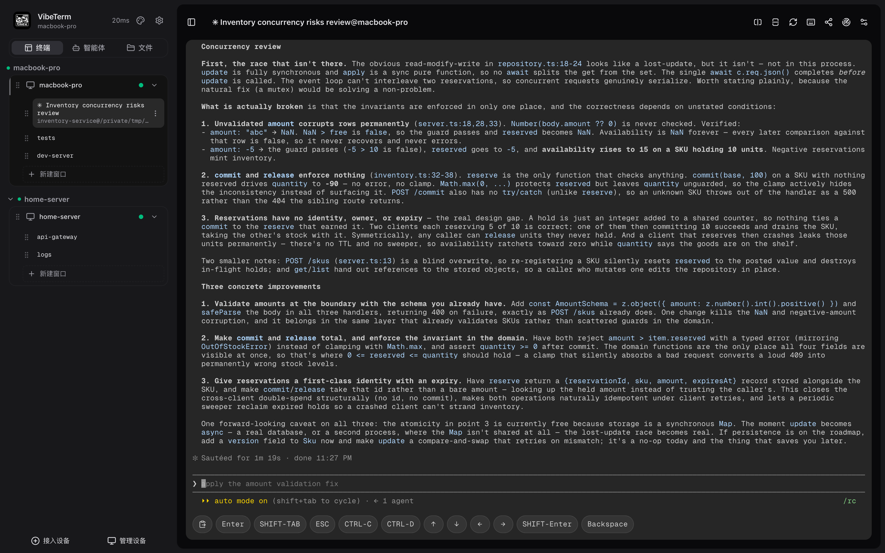
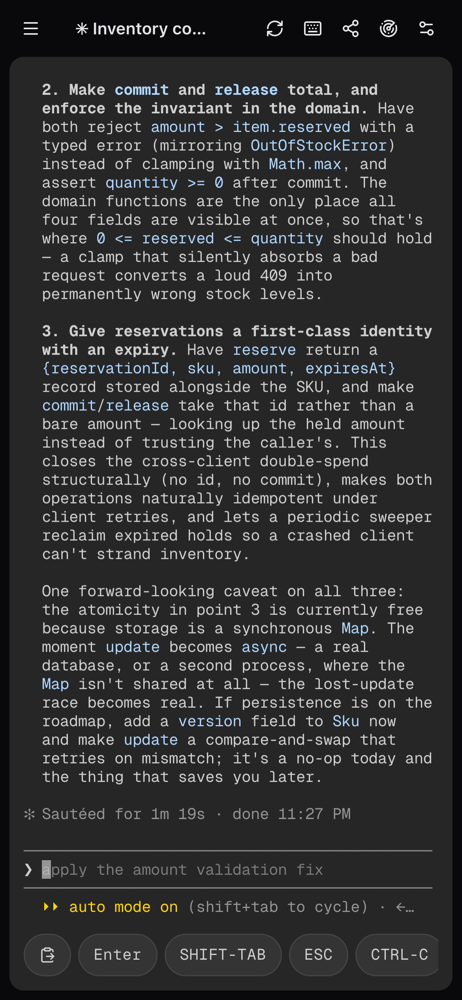
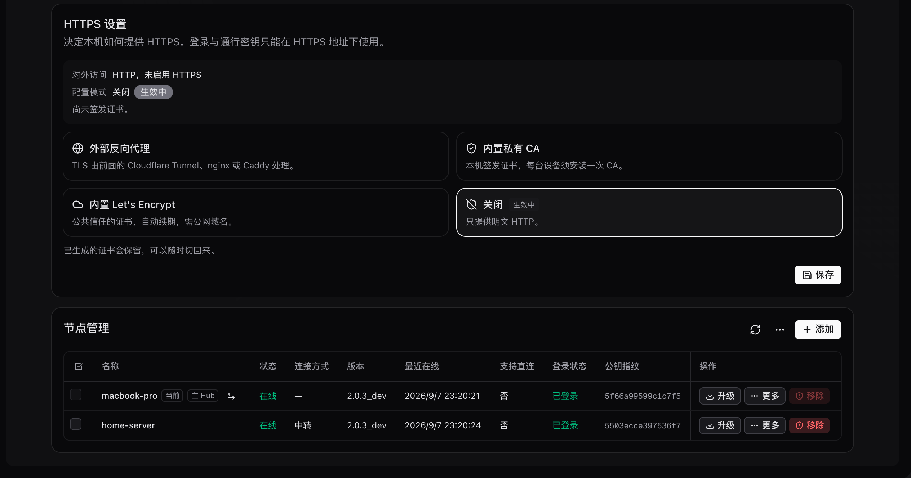

<div align="right">
  <a href="./docs/README.en.md">English</a>
</div>

<div align="center">
  
</div>

<h1 align="center">VibeTerm - 做最好用的远程 Vibe Coding 终端</h1>

<p align="center">
  <a href="https://github.com/12dora/vibe-term/releases"></a>
  <a href="./LICENSE"></a>
  
</p>

<p align="center">
  开源、自托管的 Web 终端：在手机、平板或任意浏览器里接管所有机器的 tmux 会话。<br/>
  让 Claude Code、Codex 这类 AI 编码助手长时间运行，随时随地看结果、发指令。
</p>

```bash
curl -fsSL https://raw.githubusercontent.com/12dora/vibe-term/main/install.sh | bash
```

<p align="center">
  
</p>

VibeTerm 基于 tmux 与 Ghostty，把 Mac、Linux 服务器、NAS 和云主机连成一张网。所有机器只需出站连接，没有公网 IP 也能穿透 NAT；节点之间端到端加密，中转服务器只见密文。它是 SSH 客户端与云端 IDE 之外的第三种远程开发方式：终端始终运行在用户自己的机器上，换个设备即可接着用。

## 特色功能

| **多机互联** | **端到端加密** | **终端共享** |
|---|---|---|
| 登录任意一台机器，即可看到并操作全部机器。 | 节点之间用 AES-256-GCM 加密，中转服务器只见密文。 | 一条链接把终端分享给同事，支持口令保护与录制回放。 |

| **本地般流畅** | **文件传输** | **AI Agent** |
|---|---|---|
| 滚动、输入与本地终端一样跟手，手机上也是。 | 浏览器与机器、机器与机器之间自由传文件。 | 读屏、执行命令、驱动交互程序，跟随当前窗格。 |

| **端口映射** | **手机与平板** | **通行密钥** |
|---|---|---|
| 把远端机器的端口映射到本机，像本地服务一样访问。 | 安装为 PWA，软键盘不破坏终端布局。 | Passkey / TOTP 二次验证，密码永不离开浏览器。 |

## 平台支持

| | 平台 |
|---|---|
| **服务端** | macOS · Linux · Windows（计划中） |
| **客户端** | 任意现代浏览器；iOS / Android 可安装为 PWA |

<p align="center">
  
</p>

## 部署模式

| **独立** | **Hub** | **中继** |
|---|---|---|
| 单机安装即用，默认只监听本机。 | 一台有公网地址的机器做入口，其余机器作为节点加入，只需出站连接。可再加一台备用 Hub。 | 没有公网地址时，借用他人或自建的中继转发密文，多人可共用一台中继。 |

**Hub 与中继的区别**

| | Hub | 中继 |
|---|---|---|
| 归属 | 用户自己的一台机器，同时也是一个完整节点 | 专门转发流量的公共服务器，可由第三方运营 |
| 可见信息 | 节点清单、在线状态、连接信令；终端内容仍是节点间端到端加密 | 只知道节点编号与流量字节；节点名、设备清单、终端内容全部是密文 |
| 登录入口 | 用它的公网地址打开网页登录 | 没有网页；从租户自己的任意一台节点登录 |
| 适用场景 | 有一台带公网 IP 或域名的机器（云主机、能端口转发的家用 NAS） | 所有机器都在 NAT 后无法暴露端口，或需要用一台服务器为多位用户提供转发 |

<p align="center">
  
</p>

## 部署方式

### AI 部署

将下面的提示词发给 Claude Code、Codex 等 AI 编码助手，助手会读取 [AI 部署指南](./docs/operations/ai-deploy.md) 并在目标机器上完成部署。尖括号里的内容按实际情况替换。

| 场景 | 提示词 |
|---|---|
| 独立部署 | `请读取 https://raw.githubusercontent.com/12dora/vibe-term/main/docs/operations/ai-deploy.md，按「独立部署」一节在这台机器上部署 VibeTerm。` |
| 建立 Hub · 有公网域名 | `请读取 https://raw.githubusercontent.com/12dora/vibe-term/main/docs/operations/ai-deploy.md，按「Hub：公网域名」一节部署 Hub。域名是 <域名>，80/443 端口 <可用/不可用>。` |
| 建立 Hub · 无公网 IP，路由器端口转发 | `请读取 https://raw.githubusercontent.com/12dora/vibe-term/main/docs/operations/ai-deploy.md，按「Hub：端口转发」一节部署 Hub。路由器会把公网端口 <端口> 转发到这台机器，公网地址是 <IP 或 DDNS 域名>。` |
| 建立 Hub · 无公网 IP，Cloudflare Tunnel | `请读取 https://raw.githubusercontent.com/12dora/vibe-term/main/docs/operations/ai-deploy.md，按「Hub：Cloudflare Tunnel」一节部署 Hub。隧道域名是 <域名>。` |
| 加入 Hub | `请读取 https://raw.githubusercontent.com/12dora/vibe-term/main/docs/operations/ai-deploy.md，按「加入 Hub」一节把这台机器加入 Hub。加入码是 <加入码>。` |
| 建立中继 · 有公网域名 | `请读取 https://raw.githubusercontent.com/12dora/vibe-term/main/docs/operations/ai-deploy.md，按「中继：公网域名」一节部署中继。域名是 <域名>，80/443 端口 <可用/不可用>。` |
| 建立中继 · 无公网 IP，路由器端口转发 | `请读取 https://raw.githubusercontent.com/12dora/vibe-term/main/docs/operations/ai-deploy.md，按「中继：端口转发」一节部署中继。路由器会把公网端口 <端口> 转发到这台机器，公网地址是 <IP 或 DDNS 域名>。` |
| 建立中继 · 无公网 IP，Cloudflare Tunnel | `请读取 https://raw.githubusercontent.com/12dora/vibe-term/main/docs/operations/ai-deploy.md，按「中继：Cloudflare Tunnel」一节部署中继。隧道域名是 <域名>。` |
| 加入中继 | `请读取 https://raw.githubusercontent.com/12dora/vibe-term/main/docs/operations/ai-deploy.md，按「加入中继」一节把这台机器接入中继。中继地址是 <地址>，租户编号是 <编号>。` |

### 人工部署

一行命令安装后，用 `vibeterm --help` 查看全部子命令；`vibeterm doctor` 诊断环境，`vibeterm upgrade` 升级。完整手册见 [部署指南](./docs/operations/production-install.md) 与 [mesh 运维](./docs/operations/mesh-operations.md)。

## 致谢

VibeTerm 源自 [krhougs/tmex](https://github.com/krhougs/tmex)，感谢原作者奠定的 tmux Control Mode 与 Ghostty WASM 终端底座。

## 文档

架构、运维、安全与开发文档见 [docs/](./docs/README.md)。

## 开源协议

[MIT](./LICENSE)
