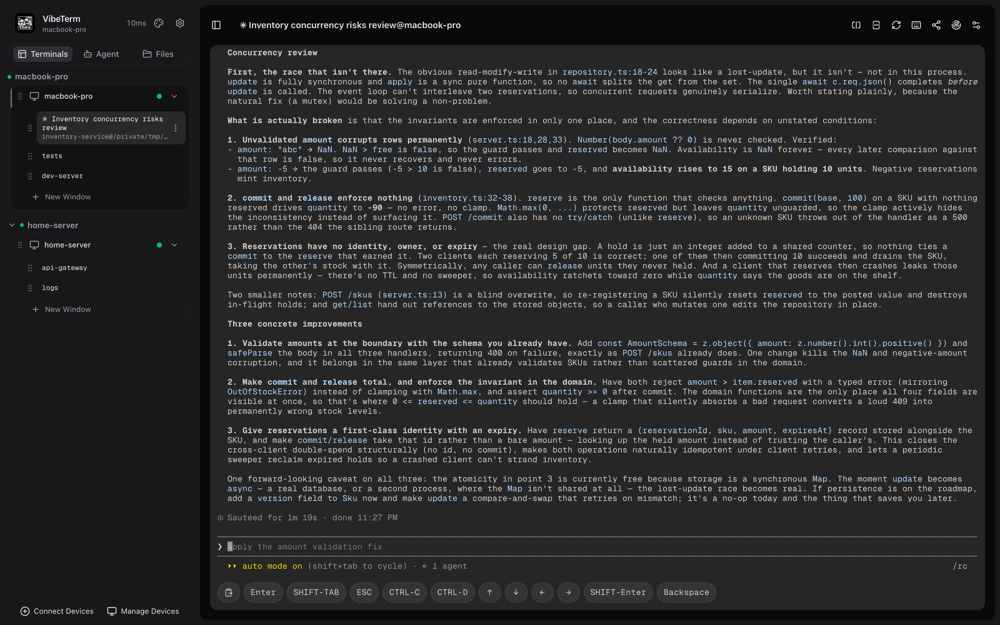
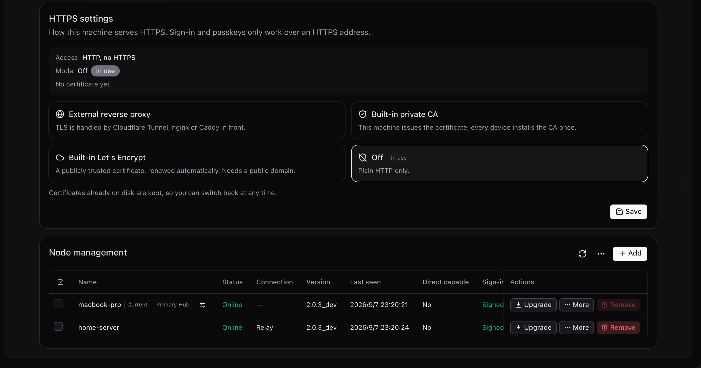

<div align="right">
  <a href="../README.md">简体中文</a>
</div>

<div align="center">
  
</div>

<h1 align="center">VibeTerm - The Remote Terminal Built for Vibe Coding</h1>

<p align="center">
  <a href="https://github.com/12dora/vibe-term/releases"></a>
  <a href="../LICENSE"></a>
  
</p>

<p align="center">
  An open-source, self-hosted web terminal: take over the tmux sessions of every machine from a phone, a tablet, or any browser.<br/>
  Keep Claude Code, Codex, and other AI coding agents running for hours, and check in from anywhere.
</p>

```bash
curl -fsSL https://raw.githubusercontent.com/12dora/vibe-term/main/install.sh | bash
```

<p align="center">
  
</p>

VibeTerm is built on tmux and Ghostty and links Macs, Linux servers, NAS boxes, and cloud VMs into one mesh. Every machine needs only outbound connections, so it works behind NAT without a public IP; nodes are end-to-end encrypted and a relaying server only sees ciphertext. It is a third way to do remote development next to SSH clients and cloud IDEs: the terminal keeps running on the user's own machine and is simply picked up from another device.

## Features

| **Multi-machine mesh** | **End-to-end encryption** | **Terminal sharing** |
|---|---|---|
| Sign in to any one machine and see and operate all of them. | Nodes talk over AES-256-GCM; a relaying server only ever sees ciphertext. | Share a terminal with a colleague by link, with password protection and recorded playback. |

| **Feels local** | **File transfer** | **AI Agent** |
|---|---|---|
| Scrolling and typing feel like a native terminal, on the phone too. | Move files between the browser and a machine, or between machines. | Reads the screen, runs commands, drives interactive programs, and follows the active pane. |

| **Port mapping** | **Phone and tablet** | **Passkeys** |
|---|---|---|
| Map a remote machine's port to the local machine and use it like a local service. | Install as a PWA; the on-screen keyboard never breaks the terminal layout. | Passkey / TOTP second factor; the password never leaves the browser. |

## Platforms

| | Platform |
|---|---|
| **Server** | macOS · Linux · Windows (planned) |
| **Client** | Any modern browser; installable as a PWA on iOS / Android |

<p align="center">
  
</p>

## Deployment modes

| **Standalone** | **Hub** | **Relay** |
|---|---|---|
| Install on one machine and use it; binds to localhost by default. | One machine with a public address is the entry point; the others join as nodes and need only outbound connections. A standby hub can be added. | Without any public address, route ciphertext through a self-run or third-party relay; one relay can serve many users. |

**Hub vs. relay**

| | Hub | Relay |
|---|---|---|
| Ownership | One of the user's own machines, and a full node itself | A dedicated forwarding server, possibly run by a third party |
| Visible to it | Node list, online state, connection signaling; terminal traffic stays end-to-end encrypted between nodes | Node IDs and byte counts only; node names, device lists, and terminal content are all ciphertext |
| Sign-in point | Its public address serves the web UI | No web UI; sign-in happens on any of the tenant's own nodes |
| When to use | A machine with a public IP or domain is available (a cloud VM, a NAS behind a port-forwarding router) | Every machine sits behind NAT with no port to expose, or one server should forward for several users |

<p align="center">
  
</p>

## Deploying

### Deploy with an AI agent

Paste one of the prompts below into Claude Code, Codex, or a similar coding agent. It reads the [AI deployment guide](./operations/ai-deploy.md) and completes the deployment on the target machine. Replace the angle-bracket placeholders with the actual values.

| Scenario | Prompt |
|---|---|
| Standalone | `Read https://raw.githubusercontent.com/12dora/vibe-term/main/docs/operations/ai-deploy.md and deploy VibeTerm on this machine following the "独立部署" (Standalone) section.` |
| Create a hub · public domain | `Read https://raw.githubusercontent.com/12dora/vibe-term/main/docs/operations/ai-deploy.md and set up a hub following the "Hub：公网域名" (Hub: public domain) section. The domain is <domain>; ports 80/443 are <available/unavailable>.` |
| Create a hub · no public IP, router port forwarding | `Read https://raw.githubusercontent.com/12dora/vibe-term/main/docs/operations/ai-deploy.md and set up a hub following the "Hub：端口转发" (Hub: port forwarding) section. The router forwards public port <port> to this machine; the public address is <IP or DDNS domain>.` |
| Create a hub · no public IP, Cloudflare Tunnel | `Read https://raw.githubusercontent.com/12dora/vibe-term/main/docs/operations/ai-deploy.md and set up a hub following the "Hub：Cloudflare Tunnel" section. The tunnel hostname is <domain>.` |
| Join a hub | `Read https://raw.githubusercontent.com/12dora/vibe-term/main/docs/operations/ai-deploy.md and join this machine to the hub following the "加入 Hub" (Join a hub) section. The join code is <join code>.` |
| Create a relay · public domain | `Read https://raw.githubusercontent.com/12dora/vibe-term/main/docs/operations/ai-deploy.md and set up a relay following the "中继：公网域名" (Relay: public domain) section. The domain is <domain>; ports 80/443 are <available/unavailable>.` |
| Create a relay · no public IP, router port forwarding | `Read https://raw.githubusercontent.com/12dora/vibe-term/main/docs/operations/ai-deploy.md and set up a relay following the "中继：端口转发" (Relay: port forwarding) section. The router forwards public port <port> to this machine; the public address is <IP or DDNS domain>.` |
| Create a relay · no public IP, Cloudflare Tunnel | `Read https://raw.githubusercontent.com/12dora/vibe-term/main/docs/operations/ai-deploy.md and set up a relay following the "中继：Cloudflare Tunnel" (Relay: Cloudflare Tunnel) section. The tunnel hostname is <domain>.` |
| Join a relay | `Read https://raw.githubusercontent.com/12dora/vibe-term/main/docs/operations/ai-deploy.md and connect this machine to the relay following the "加入中继" (Join a relay) section. The relay address is <address>; the tenant ID is <id>.` |

### Deploy by hand

After the one-line install, run `vibeterm --help` for every subcommand; `vibeterm doctor` checks the environment and `vibeterm upgrade` updates. The full manuals are the [installation guide](./operations/production-install.md) and [mesh operations](./operations/mesh-operations.md) (Chinese).

## Acknowledgements

VibeTerm started as a fork of [krhougs/tmex](https://github.com/krhougs/tmex). Thanks to its author for the tmux Control Mode and Ghostty WASM terminal foundation.

## Documentation

Architecture, operations, security, and development docs live in [docs/](./README.md) (Chinese).

## License

[MIT](../LICENSE)
